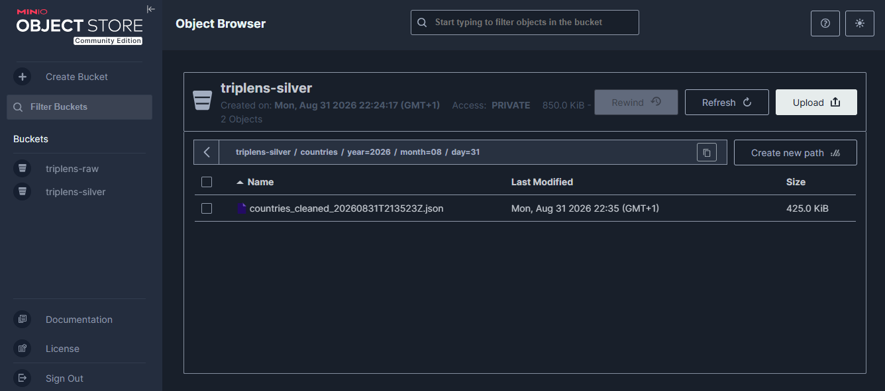
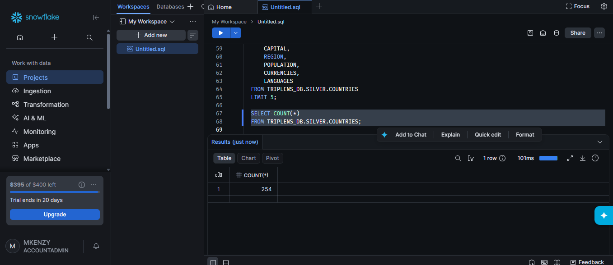
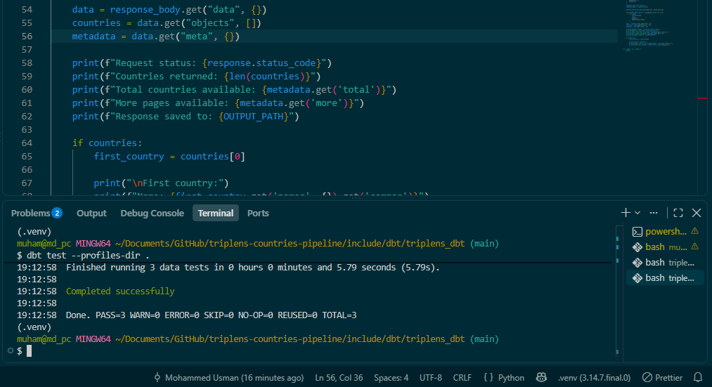
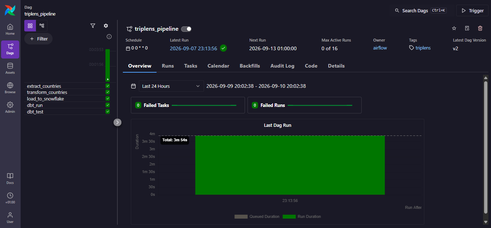
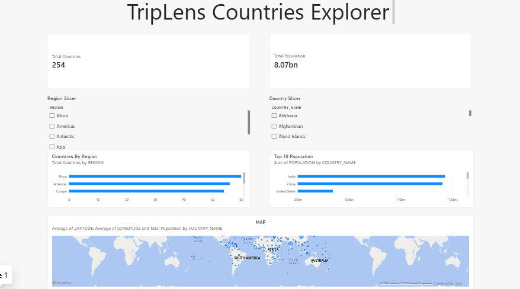
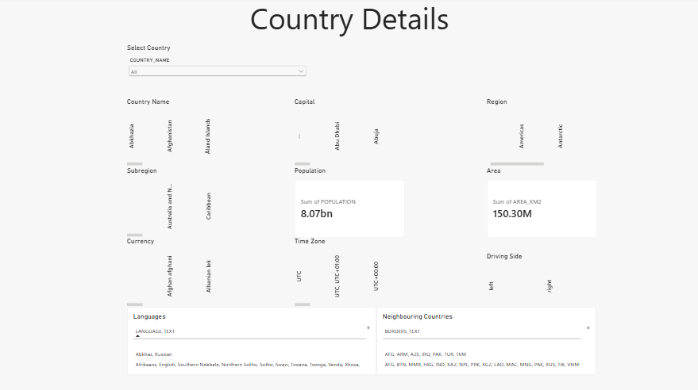
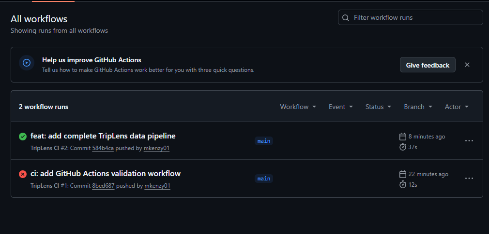

# TripLens Countries Explorer

TripLens is an end-to-end data engineering project that collects country-level information from a public REST API, processes and stores the data through a layered pipeline, models it in Snowflake using dbt, orchestrates the workflow with Apache Airflow, and presents the final data through an interactive Power BI dashboard.

The project is designed to provide travelers and travel-related businesses with a centralized way to explore information such as regions, capitals, population, currencies, languages, time zones, neighbouring countries, and other country attributes.

---------

## Project Objectives

The main objectives of the project are to:

- Extract country data from a public REST API using Python.
- Store raw API responses in MinIO for traceability and reprocessing.
- Transform nested API data into a cleaner structure.
- Store processed data in Snowflake.
- Use dbt to build an analytics-ready country model.
- Automate the complete pipeline using Apache Airflow.
- Build an interactive Power BI dashboard for country exploration.
- Use GitHub Actions to perform basic CI validation of the project.

---

## Data Source

The project uses the REST Countries API as its primary source.

The API provides country-level information including:

- Country names and codes
- Capitals
- Regions and subregions
- Population
- Area
- Coordinates
- Currencies
- Languages
- Time zones
- Borders
- Calling codes
- Driving side
- Government information
- Country classification information

A total of **254 country records** are currently processed by the pipeline.

---

## Technology Stack

| Technology | Purpose |
| --- | --- |
| Python | API extraction, transformation and loading |
| REST Countries API | Country data source |
| MinIO | Raw and processed object storage |
| Snowflake | Cloud data warehouse |
| dbt | Data transformation, modelling and testing |
| Apache Airflow / Astro | Pipeline orchestration and scheduling |
| Docker | Local containerized services |
| Power BI | Interactive data visualization |
| GitHub | Source control |
| GitHub Actions | Continuous integration validation |

---

## Project Architecture

The pipeline follows this flow:

```text
REST Countries API
        |
        v
Python Extraction
        |
        v
MinIO Raw Layer
        |
        v
Python Transformation
        |
        v
MinIO Silver Layer
        |
        v
Snowflake SILVER Schema
        |
        v
dbt Transformation
        |
        v
Snowflake ANALYTICS Schema
        |
        v
Power BI Dashboard
```

Apache Airflow orchestrates the pipeline from extraction through dbt testing.

The Airflow workflow runs:

```text
extract_countries
        |
        v
transform_countries
        |
        v
load_to_snowflake
        |
        v
dbt_run
        |
        v
dbt_test
```

The DAG is configured for a **weekly refresh**, while it can also be triggered manually when required.

### Architecture Diagram


---

## Data Pipeline

### 1. Data Extraction

The extraction script retrieves country records from the REST Countries API using Python.

Because the API is paginated, the script retrieves the records across multiple pages until all available countries have been collected.

The extracted data is:

- saved locally during development;
- wrapped with extraction metadata;
- uploaded to the MinIO raw bucket.

Raw objects are stored using timestamped paths to support traceability and future reprocessing.

Example:

```text
countries/year=2026/month=09/day=10/countries_raw_<timestamp>.json
```

---

### 2. Raw Storage with MinIO

MinIO acts as the project's object-storage layer.

Two buckets are used:

```text
triplens-raw
triplens-silver
```

The raw bucket stores API responses before transformation, while the silver bucket stores the cleaned country records produced by the Python transformation process.

This preserves the original source data independently from downstream processing.

### MinIO Storage



---

### 3. Data Transformation

The REST API contains several nested objects and arrays.

The Python transformation stage flattens structural fields such as:

```text
capital
area
coordinates
country names
classification fields
```

while preserving genuinely multi-valued fields such as:

```text
currencies
languages
timezones
borders
continents
calling codes
```

The transformation currently produces **254 cleaned country records**.

---

## Snowflake Data Warehouse

The cleaned records are loaded into Snowflake.

The main warehouse structure used by the project is:

```text
TRIPLENS_DB
│
├── SILVER
│   └── COUNTRIES
│
└── ANALYTICS
    └── COUNTRIES_ANALYTICS
```

The `SILVER.COUNTRIES` table contains the processed records loaded by Python.

The `ANALYTICS.COUNTRIES_ANALYTICS` model is created by dbt and is used as the source for Power BI.

### Snowflake Data



---

## dbt Modelling

dbt is used to transform the Snowflake silver table into an analytics-ready model.

The final model is:

```text
TRIPLENS_DB.ANALYTICS.COUNTRIES_ANALYTICS
```

Additional readable fields are created for Power BI, including:

```text
CURRENCY_TEXT
LANGUAGE_TEXT
TIMEZONE_TEXT
BORDERS_TEXT
```

These fields make nested country attributes easier to display in the dashboard.

### dbt Tests

The project currently validates:

- `uuid` is not null.
- `uuid` is unique.
- `country_name` is not null.

The tests are executed automatically as the final Airflow task.

```bash
dbt run --profiles-dir .
dbt test --profiles-dir .
```

### dbt Validation



---

## Airflow Orchestration

Apache Airflow is run locally using Astronomer Astro.

The DAG:

```text
triplens_pipeline
```

coordinates the complete pipeline.

Its tasks are:

```text
extract_countries
transform_countries
load_to_snowflake
dbt_run
dbt_test
```

A successful DAG run confirms that the pipeline can move data from the external API through storage, transformation, Snowflake and dbt without manually executing each individual stage.

### Successful Airflow Pipeline



---

## Power BI Dashboard

Power BI connects directly to:

```text
TRIPLENS_DB.ANALYTICS.COUNTRIES_ANALYTICS
```

The report contains two main pages.

### Countries Overview

The overview page provides high-level country exploration including:

- Total countries
- Total population
- Countries by region
- Top countries by population
- Geographic map
- Region filter
- Country filter



### Country Details

The Country Details page allows an individual country to be selected and displays information such as:

- Country name
- Capital
- Region
- Subregion
- Population
- Area
- Currency
- Time zone
- Driving side
- Languages
- Neighbouring countries



---

## GitHub Actions

A GitHub Actions workflow runs automatically when changes are pushed to the `main` branch or when a pull request targets `main`.

The CI workflow:

1. Checks out the repository.
2. Sets up Python.
3. Installs project dependencies.
4. Validates Python syntax.
5. Parses the dbt project to detect configuration or modelling errors.

The workflow does not expose production Snowflake credentials.

### Successful CI Run



---

## Project Structure

```text
triplens-countries-pipeline/
│
├── .github/
│   └── workflows/
│       └── ci.yml
│
├── dags/
│   └── triplens_pipeline.py
│
├── include/
│   └── dbt/
│       └── triplens_dbt/
│           ├── models/
│           │   ├── countries_analytics.sql
│           │   ├── schema.yml
│           │   └── sources.yml
│           ├── dbt_project.yml
│           └── profiles.yml
│
├── scripts/
│   ├── extract_countries.py
│   ├── transform_countries.py
│   ├── load_countries_to_snowflake.py
│   └── inspect_api.py
│
├── src/
│   ├── storage/
│   │   ├── minio_client.py
│   │   └── snowflake_client.py
│   │
│   └── transformation/
│       └── countries_transformer.py
│
├── screenshots/
│
├── docker-compose.minio.yml
├── Dockerfile
├── packages.txt
├── requirements.txt
├── .dockerignore
├── .gitignore
└── README.md
```

---

## How to Run the Project

### 1. Clone the Repository

```bash
git clone <repository-url>
cd triplens-countries-pipeline
```

### 2. Create the Environment File

Create a `.env` file in the project root containing the required API, MinIO and Snowflake configuration.

Example:

```env
REST_COUNTRIES_API_KEY=your_api_key

MINIO_ENDPOINT=localhost:9000
MINIO_ACCESS_KEY=your_access_key
MINIO_SECRET_KEY=your_secret_key
MINIO_BUCKET=triplens-raw
MINIO_SILVER_BUCKET=triplens-silver

SNOWFLAKE_ACCOUNT=your_account
SNOWFLAKE_USER=your_username
SNOWFLAKE_PASSWORD=your_password
SNOWFLAKE_WAREHOUSE=your_warehouse
SNOWFLAKE_DATABASE=TRIPLENS_DB
SNOWFLAKE_SCHEMA=SILVER
```

> The `.env` file is excluded from Git and should never be committed because it contains credentials.

### 3. Start MinIO

```bash
docker compose -f docker-compose.minio.yml up -d
```

### 4. Start Airflow

```bash
astro dev start
```

The Airflow interface will then be available locally through the Astro development environment.

### 5. Trigger the Pipeline

Open Airflow and trigger:

```text
triplens_pipeline
```

The pipeline will execute the extraction, transformation, Snowflake loading, dbt modelling and dbt testing stages.

The DAG is also configured to run weekly.

### 6. Run dbt Manually

If required, navigate to:

```bash
cd include/dbt/triplens_dbt
```

Then run:

```bash
dbt run --profiles-dir .
dbt test --profiles-dir .
```

### 7. View the Dashboard

Open the Power BI report and refresh the Snowflake connection to retrieve the latest analytics data.

---

## Validation

The completed pipeline has been validated at several stages:

| Stage | Validation |
| --- | --- |
| API Extraction | 254 country records retrieved |
| MinIO Raw | Timestamped raw JSON objects stored |
| Transformation | 254 cleaned records produced |
| MinIO Silver | Processed JSON stored successfully |
| Snowflake | 254 records loaded into `SILVER.COUNTRIES` |
| dbt | Analytics model created successfully |
| dbt Tests | 3 tests passed |
| Airflow | Complete DAG executed successfully |
| Power BI | Snowflake analytics model connected and visualized |
| GitHub Actions | CI workflow completed successfully |

---

## Key Challenges and Lessons Learned

| Challenge | How It Was Addressed |
| --- | --- |
| Working with nested API responses | Python transformation logic was used to flatten structural fields while preserving multi-valued fields. |
| Keeping source data traceable | Raw and processed records were stored separately in MinIO. |
| Loading semi-structured fields into Snowflake | Snowflake `VARIANT` columns were used for arrays such as languages, currencies and borders. |
| Making nested fields easier to use in Power BI | dbt created readable text versions of multi-valued fields. |
| Running local services across Docker environments | Container networking was configured so Airflow could communicate with MinIO running locally. |
| Coordinating multiple pipeline stages | Airflow was used to enforce task dependencies and automate the full workflow. |
| Preventing broken code from being pushed unnoticed | GitHub Actions was added for Python and dbt validation. |

---

## Future Improvements

Possible future improvements include:

- Integrating additional travel-related datasets.
- Adding historical country indicators where suitable.
- Expanding the Power BI report with additional travel insights.
- Deploying the Airflow environment to a cloud-hosted environment.
- Adding more automated data-quality tests as the project grows.

---

## Author

**Mohammed Usman Hussein**

Data Engineering Project